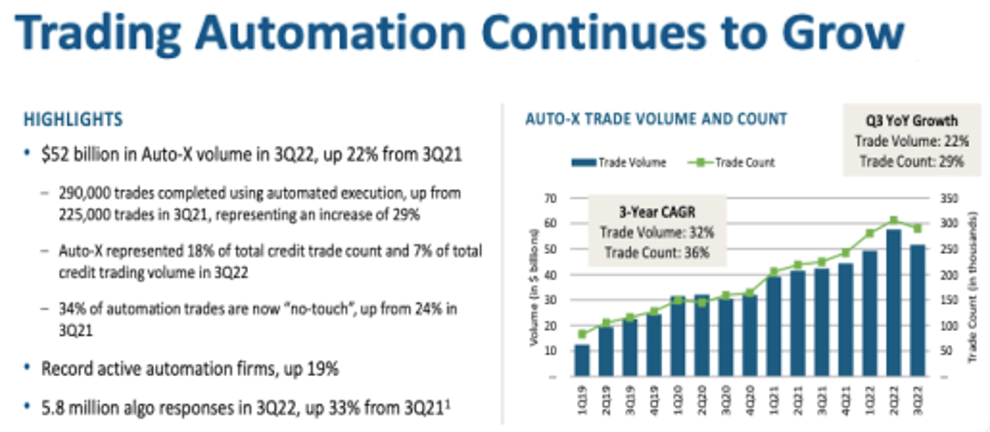

# MarketAXess #  <span style="color:orange"> **(Nasdaq: MKTX)**</span>
---


Project *Lab Morgan* spearheaded by then JP Morgan’s Senior Executive, Rick McVey, who was creating the first web-based, multi-dealer credit market trading platform. Project Lab Morgan spined off to a public trading company, MarketAxess, the CEO Rick McVey.  

In **1999**, MarketAxess started and received $55M in funding for IPO in 2008.  The share price at open was $11.  MarketAxess share price today, December 22, 2022, is $281.76.

MarketAxess is on path to remove the tale of two trading platforms.  Equity markets are traded 90% electronically and Bond Markets are not.  This company continues to make fixed-income participants to trade corporate bonds more seamlessly through electronic enablement across global fixed-income markets.

Today more than 1900 institutional investors and broker-dealer firms rely on MarketAxess to bring accurate market data to assist with trading decisions, connectivity solutions that facilitate straight-through processing and technology services to optimize trading environments. 

**MarketAxess biggest disadvantage is not offering platform use to trade corporate and municipal bonds to retail investors and traders.**  However, no platform allows electronic bond trading among retail traders.  

##  <span style="color:orange"> Tech Stat </span>

MarketAxess use a structured process that enables the shortest production time to produce high-quality, low-cost software, which is called Software Development Life Cycle **(SDLC)**.
_This company use the following technologies:_ Java, Oracle RDBMS, Kafka, Redis, React, React, Redux, Javascript, AWS, Tableau, R, Python, and MySqL.


##  <span style="color:orange"> Landscape </span>

MarketAxess is part of the Investor Management domain of financial industry.  They focus on the path to enhance their trading platform through automated trading solutions and intelligent data products.  

The business impact to MarketAxess is losing market share due to their competitors like Bloomberg, Interactive Brokers, and ThinkorSwim whom allows equity trading as well.  The measured success is to out beat competition by looking at financials, fees per million (FPM), and total credit average daily volume (ADV) which reached $13.1B, press released on December 5, 2022.




.pdf)


## <span style="color:orange"> Recommendations: </span>

I would suggest this company to open trading to retail investors; retail traders, who trades 25% of the total equities trading volume. <span style="color:orange"> “A new generation of younger retail investors are purchasing equities with the intention of becoming long-term market participants.” </span> 
  https://www.bnymellonwealth.com/insights/the-rise-of-retail-traders.html
**"The Rise of Retail Traders."**


Bond trading to retail investors will eventually happen but no time soon due to the complicity of institutions and broker/dealers trading to each other, minimum information on orders, and trading volumes must be over 100K; however, the first institution to solve wins market share!  

Technology needed is simply to allow free access to bond orders to implement bond trading to retail investors and more freely to dealer to dealer (D2D).  I believe the government will most likely step in to push this feature or the big institutions will wait, like they waited on Robinhood’s no-fee logic before the powerhouse firms decided to implement the same no-fee logic.  

```
Resources:
MarketAxess Investor Relations
Securities Industry and Financial Markets Association (SIFMA)
Vaneck.com

```
* https://investor.marketaxess.com/overview/default.aspx

* https://www.sifma.org/wp-content/uploads/2017/05/sifma-electronic-bond-trading-report-us-corporate-and-municipal-securities.pdf


* https://www.vaneck.com/us/en/blogs/emerging-markets-bonds/the-electronification-of-emerging-markets-bond-trading/


